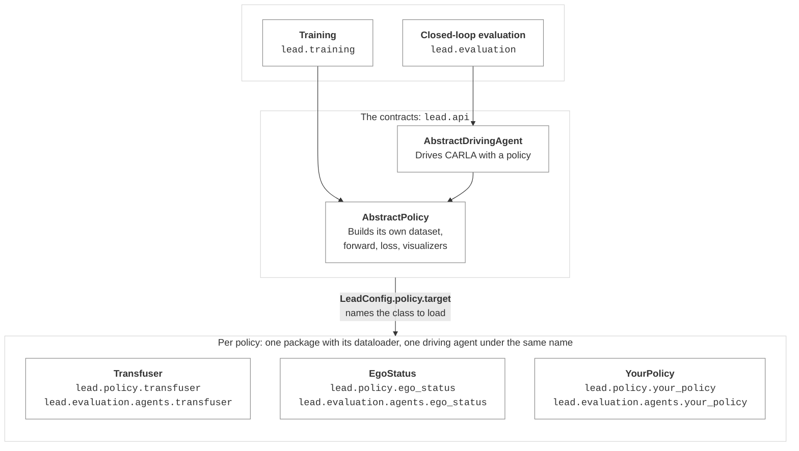
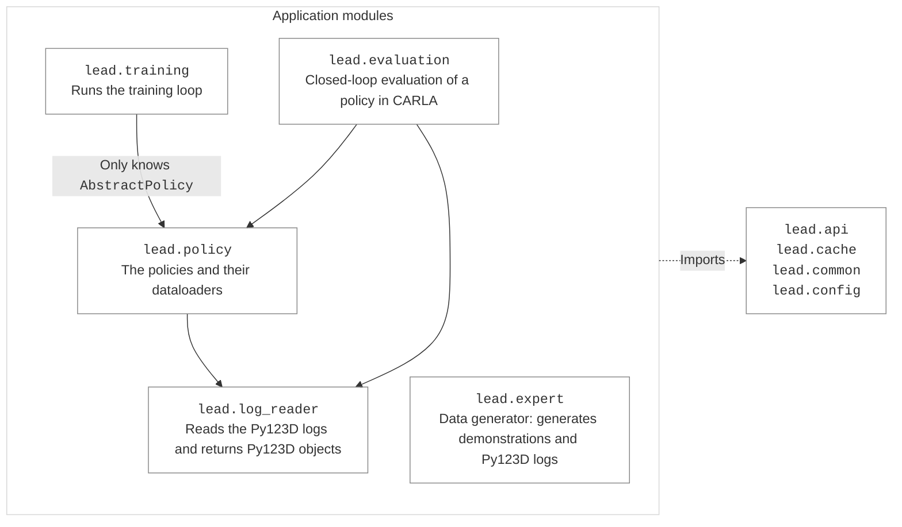
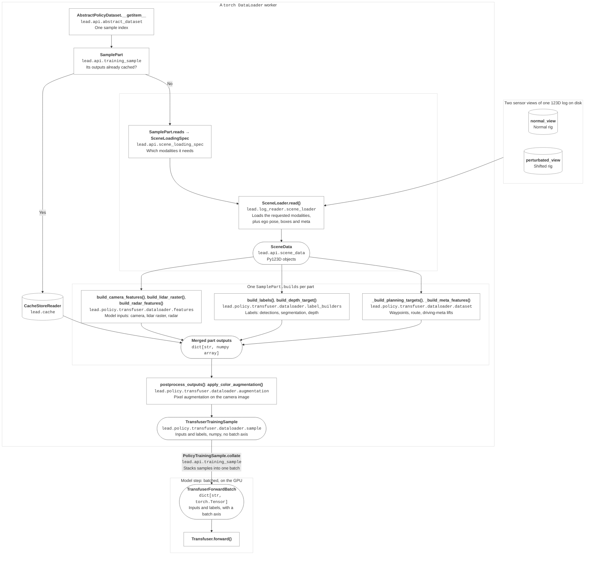

# Architecture

LEAD is a dataset, and policies that are swappable behind two contracts.

Every policy brings its own dataloader and its own driving agent, and one config field decides which
one training builds and which one evaluation drives. Because every module talks through those
contracts instead of to a policy directly, the dependency graph only ever points one way —
machine-checked by the `layered architecture` import contract in `pyproject.toml`:

## Disk to tensor

One `__getitem__`: read the log, derive one policy's arrays, stack them.

